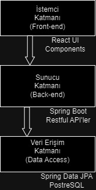
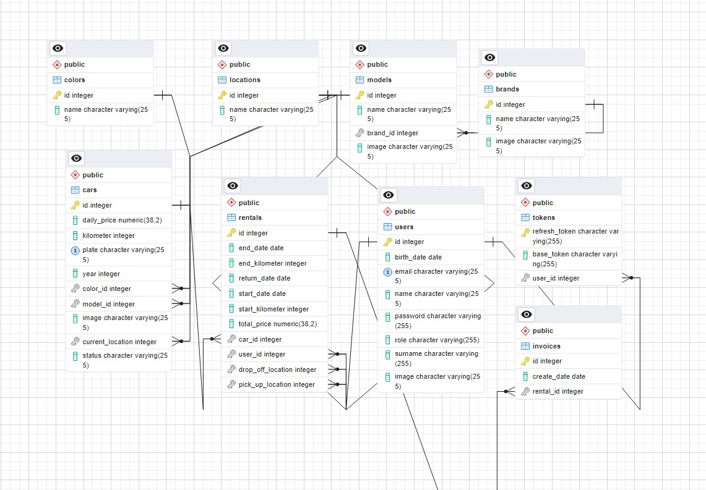
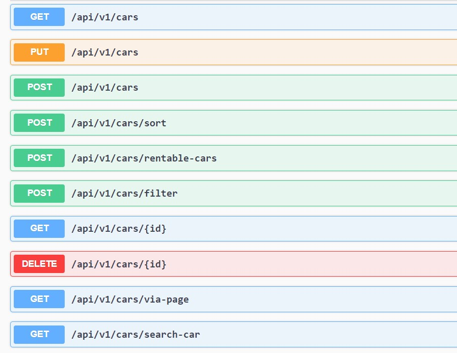

# 🌟 Tobeto Full Stack Training Project- RentACar
---

This project is a result of the comprehensive Java-React Full-stack training program conducted by Tobeto. It serves as a practical application of the skills and knowledge acquired during the training.


---


## 🚀 Contributors

The contributors to this project are individuals who actively participated in Tobeto's full-stack training program:

- [Tuğberk Urgancı](https://github.com/tugberkurganci)
- [Halil İbrahim Koçoğlu](https://github.com/halilkocoglu)
- [Duygu Yalçın](https://github.com/Duyguyalcn)
- [Rami Koco](https://github.com/RamiKoco)

**:star: Thank you for taking the time to read. If you find the project interesting or would like to appreciate our effort, you can star it. :smile:**

---
## Contents:

1. [Installation](#installation)
2. [Project Description](#desc)
3. [Objectives](#objectives)
4. [Architectural Features](#arch)
5. [Used Technologies and Tools](#techs)
6. [Database Structure](#db)
7. [API Definition](#api)
8. [Page and Component Definitions](#comps)
9. [Tests](#tests)
10. [Debugging and Troubleshooting](#debug)


---
<span id="installation"> </span>


##  🛠️ Installation  

To run the project locally and experience the skills developed in Tobeto's full-stack training, follow these steps:

**Requirements**
- Java Development Kit (JDK) 8 or higher
- Node.js and Node Package Manager (NPM)
- Git

### Installation Steps

**First, download the project to your local machine by cloning it from GitHub:**

   ```
   git clone https://github.com/tugberkurganci/rentACar.git
   ```
#### Server Side Installation
**1. Open the terminal and navigate to the project directory:**
```
  cd rentACar/server/pair-3
   ```
   **2. Run the following command to install project dependencies:**
```
  mvn clean install
   ```
   **3. Run the following code to start the server side:**
```
  mvn spring-boot:run
   ```
   #### Client Side Installation
   **1. Open the terminal and navigate to the project directory:**
```
  cd rentACar/client
   ```
   **2. Run the following command to install project dependencies:**
```
  npm install
   ```
   **3. Run the following code to start the client side:**
```
  npm run dev
   ```
   #### Usage of Website
   **After successfully starting the server and client sides, you can visit the car rental website in your browser using the following address:**
   ```
  http://localhost:5173
   ```
   **You can now use the car rental website in your local development environment!**

---
<span id="desc"> </span>

   ## Project Description
   The car rental website is a platform owned by a single car rental company where users can carry out car rental processes online. This website allows users to select the vehicles they desire (based on the dealerships or locations where the vehicles are located) and manage the rental process. Additionally, the site incorporates a membership system for both users and administrators. It enables the owner and administrators of the car rental company to add, delete, read, and update user information, vehicle information, model information related to vehicles, and rental information, except for exceptional circumstances and needs. The documentation encompasses the general description and objectives of the car rental website project. In subsequent sections, topics such as project architecture, technologies, and tools used will be discussed in detail.

---
<span id="objectives"> </span>


## Objectives
The main objectives of this project are as follows:
   ### User-Friendly Interface
Users can easily search, filter, and select vehicles. They can visually inspect vehicles, view their technical specifications, and quickly become members to rent them.
### Flexible Rental Conditions
Users can rent vehicles by entering their desired date range (up to 25 days maximum) and utilizing the dealership that suits them best.
### Management Panel for Dealership Owners and Managers
The website provides a special management panel for dealership or company owners, enabling them to track their vehicles, users, rental information, and vehicle model details. They can intervene by deleting, editing as needed, and ultimately adding new entries.

---
<span id="arch"> </span>

## Architectural Features
The project utilizes Java and React technologies and follows an N-tier architectural pattern with a monolithic structure. The architectural features of the car rental website project include:
### Technology Stack
- **Server-side (Back-end):** Java with Spring framework was used. Spring Boot was chosen for its ability to facilitate rapid and easy application development.
- **Client-side (Front-end):** A modern and interactive user interface (SPA - Single Page Application) was developed using React.
- **Database:** PostgreSQL was used as the database.

### Monolithic Structure
The car rental website has a monolithic structure where all functionalities are housed within a single application. This approach initially provides a simpler deployment and management process. Essentially, there are three main layers:

- **Server Layer (Back-end):** This layer contains the business logic and provides RESTful APIs developed using Spring Boot.
- **Client Layer (Front-end):** This layer houses the user interface, with a modern web interface built using React.
- **Data Access Layer:** This layer facilitates communication with the database, performing database operations using Spring Data JPA.

### Architectural Diagram
Below is a diagram illustrating the project architecture of the car rental website:



---
<span id="techs"> </span>

## Used Technologies and Tools
The technologies and tools utilized in the development process include:

### Server Side (Back-end)
####  1. Programming Language and Framework
- **Java:** Java version 17 programming language was used.
- **Spring Framework:** Provided a robust infrastructure for creating RESTful APIs.
- **Spring Boot:** Enabled rapid configuration and launch of Spring applications.

#### 2. Authentication and Authorization

- **JWT (JSON Web Token):** Used for managing user sessions, authentication, authorization, and security.
#### 3. Database

- **PostgreSQL:** Utilized as a relational database management system to store data such as vehicles, users, invoices, rentals, locations, and tokens.

#### 4. Additional Packages

- **Spring Data JPA:** Used for the data access layer of the car rental website.
- **Spring-boot-starter-validation:** Used for validating input data.
- **Spring-boot-starter-web:** Provides core dependencies for Spring Boot web applications.
- **Spring-boot-devtools:** Provides automatic reloading and other development tools during the development process.
- **Lombok:** Reduces repetitive code writing in Java and automatically generates methods like getter, setter.
- **Spring-boot-starter-test:** Provides necessary dependencies to start and execute tests for Spring Boot applications.
- **Modelmapper:** Facilitates object mapping operations in Java and is used to copy values between fields in classes.
- **Springdoc-openapi-starter-webmvc-ui:** Provides OpenAPI documentation tools for - Spring Boot applications and integrates Swagger UI.
- **Tika-core:** Apache Tika is used to extract text, metadata, and other structured data from documents.
- **Spring-boot-starter-security:** Provides security features for Spring Boot applications, facilitating authentication and authorization processes.

### Client Side (Front-end)
#### 1. Programming Language and Framework

- **JavaScript and JSX:** The client-side application was developed using modern web technologies including JavaScript, TypeScript, JSX, and ES6 that can run on modern web browsers.
- **React:** React was used for the client-side of the car rental website.

#### 2. UI Library

- **Bootstrap:** A popular CSS framework used to create and style user interface components.

#### 3. Additional Packages

- **React-Router:** A library used to manage page routing in React applications.
- **Vite:** A JavaScript tool that provides fast development and service server for modern web development.
- **Redux:** A library for managing state in JavaScript applications.
- **React-Datepicker:** A React component used for date selection.
- **Axios:** A JavaScript library used to make HTTP requests and handle responses.
- **Formik:** A form management library that simplifies form operations.
- **i18next:** A JavaScript internationalization (i18n) library that provides multilingual support.
- **React-icons:** Allows integration of icons from popular icon libraries into React applications.
- **React-paginate:** A React component used for pagination.
- **React-toastify:** A React component used for displaying notification messages.
- **Yup:** A JavaScript library used for schema-based object validation.

### Other Tools

- **Git:** Git was used for project version control and collaboration. During the development process, code was stored and managed using Git.
- **GitHub:** Used for hosting the project's codebase and version control. During development, initial work, experiments, and contents were created in the "dev" branch. After final checks were completed, work was merged into the main branch.
- **IntelliJ IDEA:** IntelliJ IDEA was used for server-side development.
- **Visual Studio Code (VS Code):** VS Code was used for client-side development.

---

<span id="db"> </span>


## Database Structure
The database structure of the car rental website can be examined below:



**1. Brands Table**

| Field | Data Type | Description |
| ----------- | ----------- | ----------- |
| id | INTEGER | Brand ID (PK) |
| name | CHARACTER VARYING | Brand Name |
| image | CHARACTER VARYING | Path to Brand Image |

**2. Cars Table**

| Field | Data Type | Description |
| ----------- | ----------- | ----------- |
| id | INTEGER | Car ID (PK) |
| color_id | INTEGER | Color ID (FK) |
| model_id | INTEGER | Model ID (FK) |
| current_location | INTEGER | Dealership Where the Car is Located (FK) |
| daily_price | NUMERIC | Daily Rental Price of the Car |
| kilometer | INTEGER | Kilometers of the Car |
| plate | CHARACTER VARYING | License Plate |
| year | INTEGER | Model Year of the Car|
| image | CHARACTER VARYING | Path to Car Image |
| status | CHARACTER VARYING | Status of the Car|

**3. Colors Table**
| Field | Data Type | Description |
| ----------- | ----------- | ----------- |
| id | INTEGER | Color ID (PK) |
| name | INTEGER | Color Name |

**4. Invoices Table**
| Field | Data Type | Description |
| ----------- | ----------- | ----------- |
| id | INTEGER | Invoice ID (PK) |
| rental_id | INTEGER | Rental ID Associated with the Invoice (FK) |
| create_date | DATE | Date of Invoice Creation |

**5. Locations Table**
| Field | Data Type | Description |
| ----------- | ----------- | ----------- |
| id | INTEGER | Location ID (PK) |
| name | CHARACTER VARYING | Dealership Location Name |

**6. Models Table**

| Field | Data Type | Description |
| ----------- | ----------- | ----------- |
| id | INTEGER | Model ID (PK) |
| brand_id | INTEGER | Brand ID (FK) |
| name | CHARACTER VARYING | Model Name |
| image | CHARACTER VARYING | Path to Model Image |

**7. Rentals Table**

| Field | Data Type | Description |
| ----------- | ----------- | ----------- |
| id | INTEGER | Rental ID (PK) |
| car_id | INTEGER | Car ID (FK) |
| user_id | INTEGER | User ID (FK) |
| pick_up_location | INTEGER | Location ID Where the Car is Picked Up (FK) |
| drop_off_location | INTEGER | Location ID Where the Car is Dropped Off (FK) |
| start_kilometer | INTEGER | Initial Kilometers of the Car |
| end_kilometer | INTEGER | Kilometers of the Car at Return |
| start_date | INTEGER | Start Date of the Rental |
| end_date | INTEGER | End Date of the Rental |
| return_date | INTEGER | Return Date of the Car |
| total_price | NUMERIC | Total Rental Price |

**8. Tokens Table**

| Field | Data Type | Description |
| ----------- | ----------- | ----------- |
| refresh_token | CHARACTER VARYING | Refresh Token (PK) |
| user_id | INTEGER | User ID (FK) |
| base_token | CHARACTER VARYING | Base Token |

**9. Users Table**

| Field | Data Type | Description |
| ----------- | ----------- | ----------- |
| id | INTEGER | User ID (PK) |
| name | CHARACTER VARYING | User Name |
| surname | CHARACTER VARYING | User Surname |
| email | CHARACTER VARYING | User Email (UK) |
| password | CHARACTER VARYING | User Password |
| birth_date | DATE |User Birth Date |
| role | CHARACTER VARYING | User Role |
| image | CHARACTER VARYING | Path to User Image |

---
<span id="api"> </span>

## API Definition
After starting the project, you can access all API definitions from the following link:
```http://localhost:8080/swagger-ui/index.html#/```

Below are sample API definitions for the car rental website:



**Get List of Rentable Cars** 

- **Endpoint:** POST /api/v1/cars/rentable-cars
- **Description:** Retrieves a list of all rentable cars.
- **Parameters:** Rental Start-End Dates, Car Pick-up and Drop-off Locations
- **Sample Response:** 
``` 
[
  {
    "id": 0,
    "kilometer": 0,
    "plate": "string",
    "year": 0,
    "dailyPrice": 0,
    "modelName": "string",
    "colorName": "string",
    "image": "string",
    "brandName": "string",
    "location": "string",
    "status": "string"
  }
] 

```
--- 
<span id="comps"> </span>

## Page and Component Definitions

### 1. Pages
- **Home Page (HomePage):** Contains a form for transitioning to the Rentable Cars page.
- **Cars Page (CarsPage):** Page where rentable cars are listed.
- **Car Detail (CarDetail):** Page displaying details of a selected individual car.
- **Checkout Page (Checkout):** Page displaying final summary information about the car and rental, where payment information is collected and the order is finalized.
- **Order Complete (OrderComplete):** Page that confirms to the user that the order has been successfully completed after a successful order.
- **Profile Page (Profile):** Page displaying user's rental and invoice information, and also allowing the account to be edited or deleted.
- **Admin Panel (Admin):** Page designed for authorized personnel where contents such as cars, users, rentals, and models can be added, deleted, or edited.
- **Sign In and Sign Up Pages (SignIn-SignUp):** Pages where users can sign up and log in.

### 2. Components

Multiple Used Components:

- **Formik Input:** Contains components such as input, label, and error message. Used for form inputs.
- **Pagination:** Component created for pagination on the Admin page.


---
<span id="tests"> </span>

## Tests

- **Unit Tests** 

Tests were written for important methods of the project, excluding CRUD operations. An example test: When creating an instance of the CarManager class, objects other than the mapper were mocked. The Assert library was used for verify.


```

Test
void whenInputValidShouldGetRentableCars() {

    Car car = new Car();
    // Assuming you have a method to add rentals to a car
    car.setRentals(new ArrayList<>());
    car.addRental(new Rental(LocalDate.parse("2024-01-28"), LocalDate.parse("2024-01-30")));


    // Create a request that overlaps with an existing rental
    CreateRentableCarRequest overlappingRequest = new CreateRentableCarRequest(
            LocalDate.parse("2024-01-23"),
            LocalDate.parse("2024-01-27"),
           "kadiköy",
            "kadiköy"

    );

    // Test the isReservable method
    boolean result = carManager.isReservable(car, overlappingRequest);

    // Assert that the result is false because there is an overlap
    assertTrue(result, "The car should not be reservable for overlapping dates");
}

```
---
<span id="debug"> </span>

## Debugging and Troubleshooting

**1. Server Side (Back-end)** 

For example, when we retrieve a rental by its ID, if the rental does not exist, we throw a custom exception that we created ourselves. Then, we handle this exception with a global exception handler and provide the user with a message from the message bundle.

```
public Rental getOriginalRentalById(int id) {
    return rentalRepository.findById(id).orElseThrow(() ->
            new BusinessException(
(Messages.getMessageForLocale
("rentACar.exception.rental.notfound",
 LocaleContextHolder.getLocale()))));
}
```

**2. Client Side (Front-end)**

On the front-end side, if we encounter an error when making an API endpoint request, and if the error is a validation error, we share our validation errors using the method provided by the Formik package for the formikErrors field. Additionally, if any other error occurs, we share it using a toaster.


```
const handleFilterCarList = async (
    values: CarFilterKeys,
    { setErrors }: FormikHelpers<CarFilterKeys>
  ) => {
    try {
      let response;
      response = await axiosInstance.post(`/v1/cars/filter`, {
        ...values,
        carList: carList,
      });
      setFilteredCarList(response.data);
      setMenuIsOpened(false);
    } catch (error: any) {
      if (error.response.data.validationErrors) {
        const validationErrors: Record<string, string> =
          error.response.data.validationErrors;
        const formikErrors: Record<string, string> = {};
        Object.entries(validationErrors).forEach(([field, message]) => {
          formikErrors[field] = message;
        });
        setErrors(formikErrors);
      } else {
        toast.error(error.response.data.message);
      }
    }
  };
```
--- 


**:star: Thank you for taking the time to read. If you find the project interesting or would like to appreciate our effort, you can star it. :smile:**


